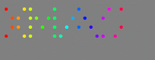

+++
title = "Christmas with a Pi Zero"
date = 2015-12-13
+++

I picked up a couple of [Raspberry Pi Zeroes](https://www.raspberrypi.org/blog/raspberry-pi-zero/) (plus one with the Mag Pi magazine, which I'm not going to open) when they went on sale. It's Christmas, so what better than a Christmas Pi project?

While in the local garden centre, I saw a Christmas ornament I quite liked - the word XMAS in MDF lit up with LEDs. But they were just regular LEDs, and that's dull. An idea formed.

The project is underway, but here's where we are so far:

* Four letters (X, M, A and S) ordered in MDF from <inf.co.uk>. I considered making the letters myself, but I don't yet have access to the scroll-saw at work and I figured I'd just make a mess doing it by hand. I'll put up some photos when they arrive. I've gone for a flat bottomed Arial Bold, as the serif fonts are generally asymmetric and that messes with the LED layout.

* 40 off [WS2811 5mm Neo-Pixel LEDs](https://www.coolcomponents.co.uk/digital-rgb-addressable-led-5mm-through-hole-10-pack.html) ordered from <coolcomponents.co.uk>. The standard LED format will be so much cleaner when mounted in the letters than the more common surface mount versions. A dab of glue should hold them in place. I bought some rainbow ribbon to use as hook-up wire as well.

* Some WS2811 test code at <https://github.com/thejpster/rpi_ws281x>. They're known to have tight timing requirements, so I looked around for someone who's already done the work on a Pi. I found an existing Pi library which used sent data to the PWM engine using DMA , but I had to patch up support for inverted outputs (I'm using an inverting hex buffer I had lying around in a scraps box to bump the 3.3V output to 5V). If you don't fix it, you'll find the green channel on the first LED stuck at 100%, which is really confusing. I used a breadboard to wire up a couple of the LEDs, and it now all seems to work OK.

* Python test code. The Zero will run a web interface in order to select the currently running routine. To test the animations in advance of the build, I've been rendering them to animated GIF. Here are the first three routines, and although I'm not convinced about the snow effect, I quite like the other two. The LEDs won't be strictly laid out like that, but I hope to keep the same sort of grid as it makes the effects easier.

