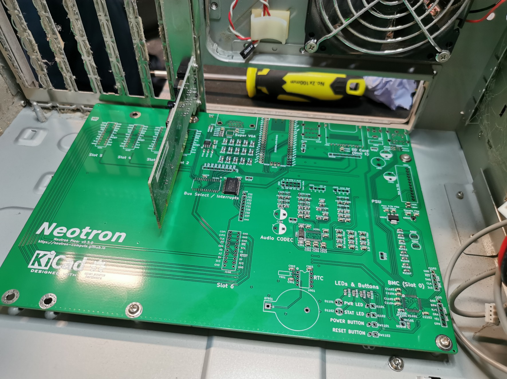

+++
title = "It's definitely micro ATX sized!"
date = "2021-06-28"
+++

I designed this board without any other ATX board to compare to, or without an ATX case to measure up. I instead used the ATX 2.03 specification, which can be found online.

Today I obtained an old ATX case and I'm delighted to report that not only does it appear that all the screw holes line up, but that expansion cards mounted the "PCI" way around* are also pretty much centered on the expansion connections I picked.

Now I just need to design an expansion card! I'll probably do something with a through-hole prototyping area and get 20 or so made - they won't be very expensive. The trick will be in providing a screw hole that lines up with the kinds of expansion bracket you get from cheap 'scrap' PCI cards, as I don't know if you can buy that sort of thing separately. Note that ISA expansion card headers won't work as they bolt to the other side of the card.

\* PCI cards have components facing 'down' away from the I/O area and hence the PCB aligns with the top edge of the bracket. ISA cards have components facing 'up' towards the I/O area and hence the PCB aligns with the bottom edge of the bracket. Neotron expansion slots are aligned for cards that are the 'PCI' way around.

