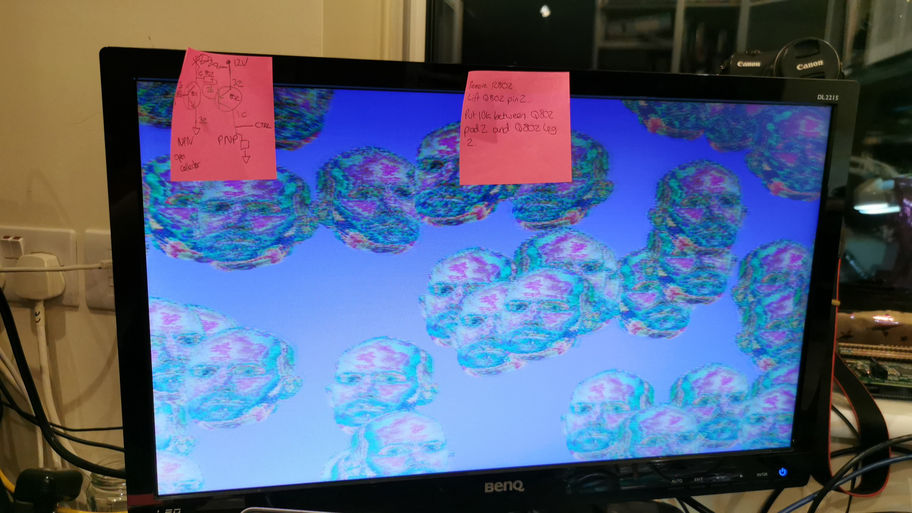

+++
title = "It's working"
date = "2021-07-07"
+++

I put the broken board to one side and built up a second. It has a bodge putting a 10k between the base of the PNP and its pad. With this I can start up the Pico with the power switch, using the STM32 for debouncing, and then power it off with a long press!

I then tried to get video out of the Pico using the Pico SDK. Sadly, it's a mess because the SDK is really not designed for 12 bit colour. I'll need to hack it a bit to test the DAC properly.