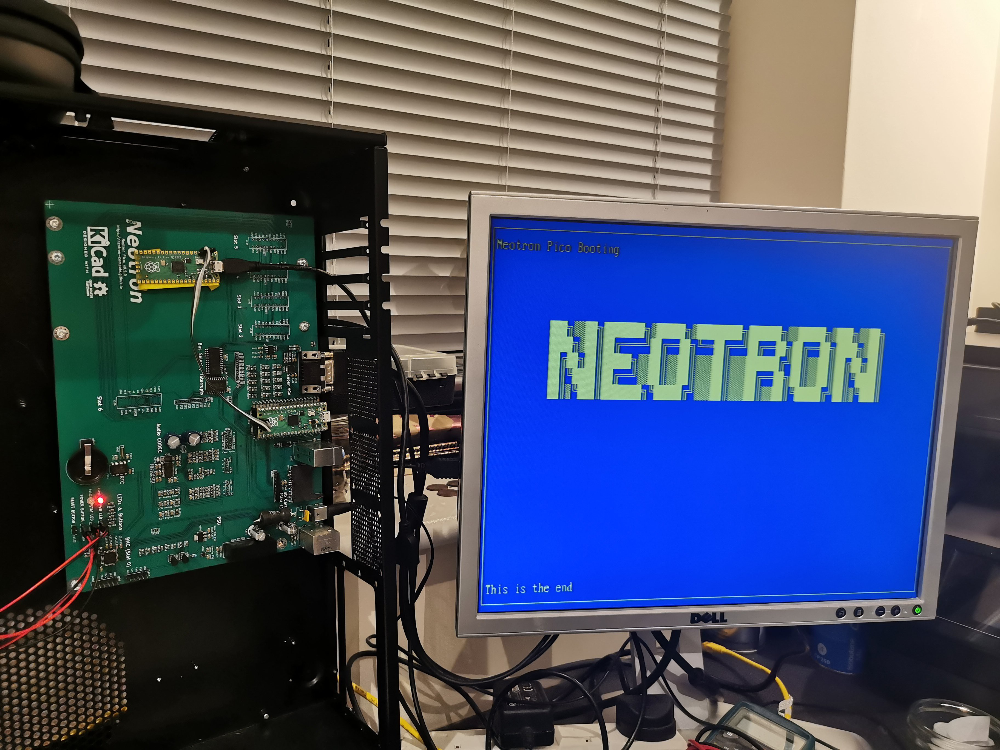

+++
title = "There's video!"
date = "2021-11-17"
+++

I finally got my head around how the PIO state machines work and how the DMA subsystem works. So now there's real-time 80x25 text mode, written in Rust! It uses just two scanline buffers (640x2 bytes each) and a text buffer of 80x25 bytes.

It uses 400 line mode at 70 Hz, but 480 lines at 60 Hz is fine too.

