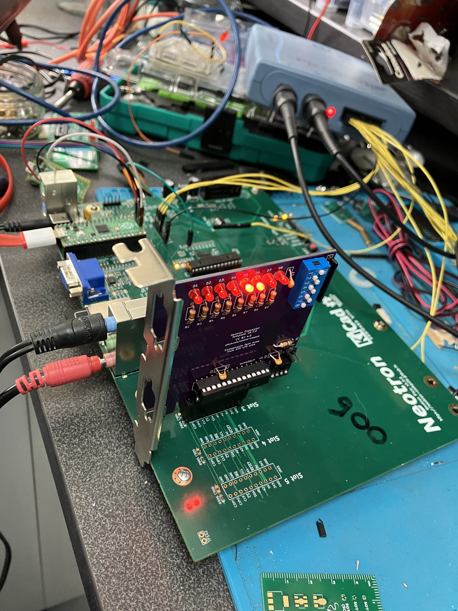

+++
title = "Rev 1.0.0 testing complete!"
date = "2022-09-30"
+++

As a bit of an experiment, I thought I'd try loading CircuitPython for the Raspberry Pi Pico onto my Neotron Pico board. Whilst the point of the board is to develop and run the Neotron OS, I found that Circuit Python was pretty useful for developing PCB tests and checking out various bits of functionality. The main advantage was that I could interact with well-tested libraries and not have to wonder if my code was wrong or the PCB was wrong!

Using the Adafruit I2C library I was able to talk to the Texas Instruments Audio CODEC and configure the various volume and audio source selection registers. This then enabled analog 'sidetone' between the Line In and the Headphone Out, so I was able to verify that those paths worked. I then switched to the Microphone input and got ... nothing. Much fiddling ensued to no avail, but when I went to unplug the microphone, I heard it pop into life. It turns out I'd set it up for a stereo microphone (mixed down to mono), whereas the mic I was using was a mono mic with only Tip and Sleeve. This meant the Ring contact in the jack was shorted to Sleeve, which was GND, but my circuit was shorting Tip to Ring - thus Tip was shorted to GND and there was no audio. The workaround to only half insert the jack so that Tip connects to the Ring contact only, and the Sleeve doesn't reach as far as the Ring contact. I'll put a fix on the PCB to take audio from Tip only, and send the 5V Mic Bias signal to Ring - if the microphone doesn't need the bias, it's fine for it to go to Ground. But with the jack half-inserted, we've got a functioning PA system!

The same I2C library was used in conjunction with the Adafruit DS1307 driver, and we can confirm the RTC is ticking away nicely.

Next I turned my attention to the MCP23S17 chip and quickly knocked up a Python equivalent of the driver I'd already written. Once I was happy I was driving the Debug LEDs, I set the chip to permanently select CS1 and then started up the Adafruit SD card library. Happily this was able to not only read directory listings off the card, but was able to do it at 25 MHz! Excellent news.

The final part to test was the expansion slots. I only have one card edge connector installed currently, in slot 3. But I built up a Neotron Expansion card (the template design with no changes) and I was very quickly running a larsen scanner on the expansion card LEDs, whilst simultaneously running a counter on the on-board LEDs. This shows the 3:8 decoder is working, and it correctly isolates bus devices whilst the IO chip itself is updated. Success!

So - to sum up - a small change is needed to the microphone circuit to better support mono microphones, and then I think we're ready to order 25 units of Rev 1.1.0.

