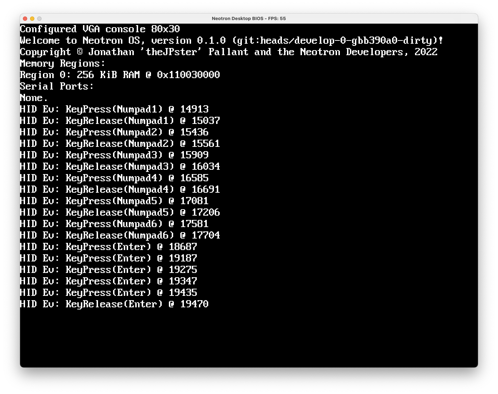

+++
title = "BIOS updates"
date = "2022-11-16"
+++

I worked on the [Neotron BIOS interface](https://github.com/neotron-Compute/neotron-common-bios) this week. I merged a bunch of long-standing changes around sharing a VGA-compatible text framebuffer, and added back in Block Device support. I also updated the [Neotron Desktop BIOS](https://github.com/neotron-Compute/neotron-desktop-bios) and the [Neotron OS](https://github.com/neotron-Compute/neotron-os), so you can now get Key Events from the pix-engine GUI window forwarded into the OS via the BIOS HID API. 

