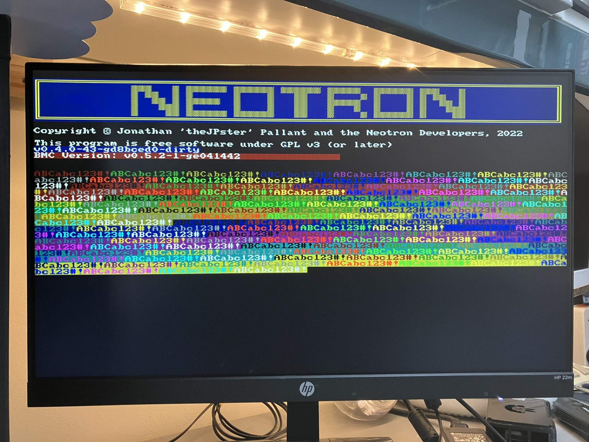

+++
title = "Colour 80-column text, finally!"
date = "2023-05-03"
+++

I've spent some time thinking about how to improve the PIO program that runs our Super VGA out. Currently it requires one 16-bit value per pixel, delivered from one of two ping-pong buffers each 1280 bytes long. Loading these buffers with RGB pixels based on characters read from the text buffer takes quite a lot of CPU time. If we limit ourselves to just two colours for the entire screen, we can build a small look-up table and get all 640 pixels drawn into the buffer per scan-line using about 90% CPU at 126 MHz.

My plan was to change the PIO so that instead of taking RGB colours as input, it instead took a series of commands: some commands to load a new colour into the X or Y register, and other commands to just clock out pixels from either the X or Y registers loaded earlier. This used almost the entire PIO memory, but I thought it should work. I coded it up with a pen and paper, and then transferred it to the computer. However, I managed to break something as despite getting a sort-of picture on the screen, most of the scan-lines per missing and the picture was rolling terribly.

I came back to it a day later, and decided to try another approach. On the Monotron, we used a huge look-up table which converted eight-bits of glyph, along with its chosen foreground and background colours, into three eight-bit values for R, G and B. The initial problem with porting this approach is that on the Neotron Pico, instead of three eight-bit values, we need eight 16-bit values (well, 12-bit values stored in 16-bit words). This blows the lookup table from 64 KiB (256 x 8 x 8 x 4 bytes) to 512 KiB (256 x 8 x 16 x 8 x 2 bytes). Plus it would be stored in off-chip Flash which has a big access latency because it's accessed over a Quad SPI interface.

One way to shorten this table would be to use an array of functions, where the functions store the correct pattern of foreground and background colours into the given position in the scan-line buffer. We'd need 256 functions, to cover each variant of our eight-bit input. I tried this, and the performance sucked. It also chewed up so much RAM (these functions are in RAM to avoid that Flash latency) we had to decrease the amount available to the OS. That wasn't going to work.

I also tried a 256 entry match statement, which was smaller, and faster. But still not fast enough.

I then came across an old branch where I'd worked on this problem previously. This used a lookup table containing RGB pixels, but instead of taking eight pixels as input, it takes only two pixels and so four lookups are required. The lookup table needs to be 2048 bytes long (4 x 8 x 16 x 2 x 2 bytes), which we have space for. But does it run fast enough?

No.

Previously I had to overclock the chip to 201.6 MHz (eight clocks per pixel) to get this version to work. But, I have better benchmarking tools now - I output the precise time it takes to complete the render into the scan-line buffer using the dedicated LED on the Pico. Placing an oscilloscope on the LED's control line allows me to measure the time taken using an oscilloscope. As it turns out, winding the clock speed up from 126 MHz (five clocks per pixel) to 151.2 MHz (six clocks per pixel) is just enough to get it done. We're using 90% of Core 1 to do the drawing, but it's stable.

Time for some test code to check all the colour combinations, and a little bit of ASCII art to show off...

Maybe I'll come back to the PIO improvements another day, but for now this is a big achievement. We have full 80 column VGA text mode, in either 25, 30, 50 or 60 lines, with 16 foreground colours and 8 background colours, just like on the IBM PS/2 and other VGA compatible systems. With a simple ANSI sequence interpreter in the OS, the world of Bulletin Board ASCII art awaits!

Also, this is better than the RC2014 Pico VGA Terminal can do (that is currently 40 column colour, or 80 column mono). I've sent them a note explaining how I got it to work. Everyone deserves 80 column colour text on their Pico!
 
