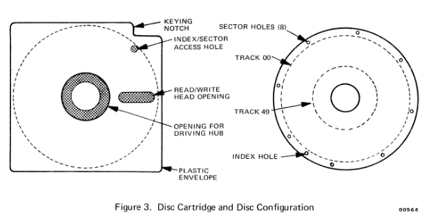

+++
title = "Everything I know about floppy disks"
date = "2023-08-28"
+++

## Intro

Floppy disk drives are curious things. We know them as the slots that ingest those small almost-square plastic "floppy disks" and we only really see them now in Computer Museums. But there's a lot going on in that humble square of plastic and I wanted to write down what I've learned so far.

# The Physical Disks

There are four main sizes of Floppy Disk.

* The 8" *Floppy Disk*, which is the oldest and dates from the very early 1970s. It's a black plastic sleeve around 200mm by 200mm, encasing a thin disc of flexible magnetic material (known as a *biscuit*). The sleeve has a small hole in it so the biscuit can be accessed by the read/write head in the floppy disk drive. There is also a hole in the centre of both the sleeve and the biscuit, so that the motor spindle can clamp down on to the biscuit in order to rotate it (typically clockwise). Disks and drives can store varying amounts of data depending on their design and specification, from 80 KiB to 1184 KiB.
* The 5.25" *Minifloppy* or *Mini Diskette* is like an 8" disk but shrunk down to around 130mm x 130mm. It has the same kind of sleeve and biscuit - just smaller. Again, disks and drives can store varying amounts of data depending on their design, from 180 KiB to 1200 KiB.
* The 3" *Compact Floppy Disk* (or *CF-2*) has a hard plastic shell surrounding the biscuit, and the access window is covered by a metal shutter that is moved out of the way by sliding a mechanism accessed from the edge of the shell. Instead of just a central hole, there is a strong, thick, plastic circle for engaging with the drive motor. Came in single-sided, 40-track versions storing 180 KiB of data and double-sided 80-track versions that hold 720 KiB. They were mostly only used by Amstrad in their CPC, PCW and Sinclair Spectrum ranges.
* The 3.5" *Micro Floppy Disk* (or *MF2*) also has a plastic shell that is somewhere between the 5.25" and 3" in terms of stiffness. The size is 90mm x 93mm. Like the 3" there is a metal shutter but it sits outside of the sleeve rather than within it, so it can be easily moved by hand to access the biscuit. The biscuit has a metal hub in the centre, for engaging with the drive motor. The very earliest mechanisms (e.g. Epson [PF10]) were 40-track but almost all drives are 80-track. Being so popular, there are a wide variety of formats leading to it storing between 400 KiB and 2880 KiB of data per disk.

# The Mechanisms

Each of the floppy disk physical formats involves some kind of outer shell, which does not move, and a biscuit, which rotates - typically clockwise when viewed from above. The biscuit is made of a magnetic material - basically a thin layer of rust stuck to a thin sheet of plastic, much like a cassette tape.

A floppy disk (or disk) must be placed into a floppy disk drive (or drive) before it can be read or written to. The drive will rotate the biscuit past a *head*, which is the component used to measure or alter the magnetic patterns in the material. When reading, the head will will generate an electrical signal according to the magnetic patterns contained with the material. When writing, the head is given an electrical signal, and will cause magnetic patterns to be recorded into the material.

## Sides

Typically a drive contains either one combined read/write head, which can only access one side of the disk, or it contains two read/write heads, one for each side of the disk.

Some disks can only be read/written on one side (*single-sided*), and some can be read/written on both sides (*double-sided*). The same terms apply to drives with one or two heads, respectively.

If you have a double-sided 8", 5.25" or 3" disk, but only single-sided drive mechanism, it may be possible to insert the disk into the drive upside down, to read the reverse side. Note that if you do this, the information will be recorded backwards compared to writing the same information on a double-sided drive. You may also find the disk drive has optical sensors to detect the presence of a *notch* cut into the outer sleeve on only one side of the disk, to prevent you performing this trick. Back in the day, cost-sensitive consumers would simply cut a second notch on the opposite side of the disk, to trick the mechanism into accepting an upside down disk. The risk was that if you did this but then obtained a double-sided drive, there was a very real chance of you inserting the disk upside down, whereupon all the data would appear to the drive backwards and unreadable.

## Tracks

The read/write head is quite small compared to our disks. If it was fixed in position, we would only be able to record data within one thin circular stripe around the surface of the inner disc and most of the disk would be wasted. This thin circular stripe is called a *track*. The drive can read or write multiple tracks on a single disk by moving the head in towards the centre of the disk. The head is often moved using a stepper motor which drives a worm-gear, as it provide very precise and repeatable positioning.

### 8" Drives

The earliest drives were 8", starting with the [IBM 23FD]. This was designed for loading microcode into the IBM *Merlin* 3300 storage subsystem, an add-one for the IBM System 370 which featured multiple removable 100 MB disk packs and probably cost an absolute fortune. The 23FD was a *read-only* drive because it had one job - to load the microcode into the storage controller. The disks would have been written by IBM and then shipped to customers. The development was led out of IBM San Jose by Direct Access Storage Product Manager Alan Shugart (that name comes up again in a bit). The IBM 23FD had 32 tracks with a stepper moving the head at 32 tracks per inch, so it doesn't appear that much of the disks' 4" radius was used for data.

Alan Shugart moved to Memorex and introduced the Memorex 650 in 1972, the first commercially available read/write floppy disk drive. This had [hard sectors](#hard-and-soft-sectors) and 50 tracks. This graphic is from the [Memorex 650 user manual]:

IBM followed the 23FD with the read-write 33FD in 1973, as used in the IBM 3470 Data Station. This had 73 data tracks, or 74 data tracks and one index track, depending in the media used. The stepper moved at what became a standard of 48 tracks per inch. The [DEC RX01] drive was introduced in 1975, which used the same 48 tpi stepper, but allowed the head to move further towards the centre hub to support 77 tracks.

### 5.25" Drives

In 1976 the *Minifloppy* format was introduced with the Shugart Associates SA400 (yes, as in Alan Shugart). It used the same 48 tpi stepper as was popular on 8" drives, but the smaller disk meant you could only have 35 tracks. Later revisions pushed this up to 40 tracks, requiring the disks to have a larger window in the sleeve and thus give the head access to a larger proportion of the biscuit's surface. If you have a a rare 35-track disk with the smaller window, and you attempt to write the higher numbered tracks, the head might crash into the sleeve.

In 1980 Shugart introduced the 80-track SA410 (single-sided) and SA460 (double sided), doubling their 48 tpi mechanism to 96 tpi (see this wonderful [Shugart Brochure]).

Around the same time, [Micropolis] introduced a 100 track-per-inch 5.25" drive, calling it the *MetaFloppy*. This enabled the 5.25" mechanism to store 77 tracks, the same as popular 8" drives like the DEC RX01. Tandon also produced some 100 tpi *Micropolis compatible* mechanisms.

Annoyingly the 100 tpi and 96 tpi systems were sort-of compatible on the outer (lower numbered) tracks, but became less reliable as you moved towards the centre of the floppy disk and the track and head moved out of alignment. You might mistaken try the wrong kind of disk for your system and be able to do a directory listing (if that was stored on, say, Track 0) but then be unable to read any of the files on the disk.

Unfortunately both the 100 tpi and 96 tpi drives will have a narrower read/write head than a 48 tpi drive, to ensure that the tracks do not overlap. If you write a 40-track disk with a 40-track drive, it will have nice wide tracks. If you then read this disk in an 80-track drive, you will have to make sure you move the head two steps for each track (known as *double stepping*) but the data should be readable. However, if you then attempt to write to the disk, the 80-track drive lays down a thin track over the top of the existing wide track, which can cause issues when it comes to reading back the data (on either kind of drive). For this reason, *enthusiasts* of the format will often have both 80-track and 40-track 5.25" floppy disk drives to hand.

### 3" Drives

The 3" drives were initially 40-track, but later available as 80-track, matching the most popular 5.25" formats and enabling these drives to be fairly compatible with existing controllers and software. The same "you can read but you probably shouldn't write" rules applied to 40 track disks in an 80 track drive.

### 3.5" Drives

3.5" drives were almost all 80-track (or perhaps slightly more if you wanted to push the mechanism and the media) but there were some very early 40-track units from Epson, like the [PF10].

Moving the head back to Track 0 usually triggers some kind of sensor so the Disk Drive Controller knows that it has reached the edge of the disk and doesn't accidentally move the head too far and off the edge of the biscuit. Cheaper drives, like those famously designed for the Commodore 64 and Apple II drives, skipped this sensor and replaced it with a hard stop that prevented the head moving to far. If the disk drive controller wanted to ensure the head was at Track Zero, it would step the head backwards at least as many times as there were tracks on disk, causing a distinctive *rat-tat-tat-tat-tat* noise as the head banged against the stop.

In the late 1990s, the LS-120 system was introduced by Matsushita. This was backwards-compatible with standard 3.5" 80-track *double-density* and *high-density* disks, but could also write to special 120 MiB LS-120 media. In this mode it used a laser to control head positioning, allowing for for 1,736 tracks per side. But, USB flash drives were just around the corner and the format ended in 2003.

## Inserting and Removing the Floppy Disk

Most 5.25" mechanisms use a lever or handle to manually drop the floppy disk down onto the motor spindle and engage the read/write head/heads. The floppy disk cannot be removed until the mechanism is unlatched by reversing the loading operation.

Conversely, 3" and 3.5" mechanisms normally auto-mount onto the spindle on insertion, and are typically ejected using a mechanical push-button that unlatches the mechanism and uses spring pressure to eject the disk. A notable exception are the floppy drives used in the Apple Macintosh which removed the eject button and used a software controlled motor to operate the eject mechanism. This ensured the computer had unmounted the filesystem and flushed the disk cache before the disk actually ejected.

## Interfaces

Most drives implement the same interface as the very early drive mechanisms, designed by a company called Shugart Associates, founded in 1973 by Alan Shugart. It is hence known as the *Shugart Interface* and its drives (the SA800 8" and the SA400 5.25") were very popular and set the standard for the industry.

The Shugart Interface has either 50 pins or 34 pins and allows you to connect the *floppy disk controller* to the *floppy disk drive* with a piece of ribbon cable that can be up to around 500mm in length. The controller is in charge of making the drive move move the head in and out, and generating or receiving the electrical signals from the read/write head.

8" drives use a 50 pin PCB edge connector. 5.25" drives use a 34 pin PCB edge connector, and 3" and 3.5" drives use a 34-pin IDC pin header connector. All three are basically electrically equivalent; the 8" drives just need a small adapter to use the newer 34-pin interface, and you can get cables that have both IDC Card Edge and IDC Pin Header connectors, allowing you to use the appropriate one for your drive.

### Standard Shugart 34 Pin Pinout

Supports up to four drives on one cable, selected by the `/DSx` select signals.

Note: D>C means the signal is an output from the Drive and an input on the Controller, whilst C>D is the opposite.

|  Pin  |   Name   | Dir  | Function                        |
| :---: | :------: | :--- | :------------------------------ |
|   2   |  `/DCC`  | D>C  | Disk Change Detect              |
|   4   |  `/DS3`  | C>D  | Select Drive 3                  |
|   6   |   N/C    | N/A  | Not used                        |
|   8   | `/INDEX` | D>C  | Index hole detected             |
|  10   |  `/DS0`  | C>D  | Select Drive 0                  |
|  12   |  `/DS1`  | C>D  | Select Drive 1                  |
|  14   |  `/DS2`  | C>D  | Select Drive 2                  |
|  16   | `/MOTOR` | C>D  | Enable Motor                    |
|  18   |  `/DIR`  | C>D  | Set head stepper direction      |
|  20   | `/STEP`  | C>D  | A pulse moves the head one step |
|  22   | `/WDATA` | C>D  | Data to be written              |
|  24   | `/WGATE` | C>D  | Enable writing of data          |
|  26   | `/TRK00` | D>C  | Head is at Track 0 position     |
|  28   |  `/WPT`  | D>C  | Disk is write protected         |
|  30   | `/RDATA` | D>C  | Data read from the disk         |
|  32   | `/SIDE1` | C>D  | Select which side               |
|  34   |  `/RDY`  | D>C  | Indicates Drive is Ready        |

### IBM PC Pinout

Supports two drives on one cable. Because it was assumed the IBM drives could not be modified to listen to different `/DSx` enable signals, all drives are set to `DS1` and the cable is twisted between pins 8 and 16, swapping `/MOTEA` with `/MOTEB` and swapping `/DRVSA` with `/DRVSB` - thus allowing two drives on one cable.

Note: D>C means the signal is an output from the Drive and an input on the Controller, whilst C>D is the opposite. Unlisted pins do the same thing as on the Shugart interface.

|  Pin  |   Name    | Dir  | Function                        |
| :---: | :-------: | :--- | :------------------------------ |
|   2   | `/REDWC`  | C>D  | Select Reduced Write Density    |
|   4   |    N/C    | N/A  | N/A                             |
|  10   | `/MOTEA`  | C>D  | Enable Motor for Drive A        |
|  12   | `/DRVSA`  | C>D  | Select Drive A                  |
|  14   | `/DRVSB`  | C>D  | Select Drive B                  |
|  16   | `/MOTEB`  | C>D  | Enable Motor for Drive B        |
|  34   | `/DSKCHG` | D>C  | Indicates disk has been changed |

All the odd numbered pins are connected to Ground. The `/REDWC` signal is unused on 3.5" drives as it can auto-detect the kind of media inserted (more on that later).

The subtle differences between these two standards explain why you can't just stick a cheap IBM PC floppy drive into a Commodore Amiga (which has a Shugart interface) without an adapter.

## Rotation Speed

Almost all drives rotate the biscuit at 300 rpm. The exceptions are 8" drives, the "High Density" 5.25" drives from the IBM PC/AT, and the 3.5" drives on the NEC PC-98, which all use 360 rpm.

Also of note are early Apple Macintosh 3.5" drives, which vary the drive rpm according to which track is being accessed. I guess this was an attempt to equalise the linear speed of the biscuit past the head (note that Track 0 is much longer than Track 80, yet in a standard drive they go past the head in the exact the same amount of time), but it only really serves to make the disks completely unreadable in anything except another Macintosh variable-speed drive. This was especially evident when the iMac removed the internal floppy drive and required people to buy USB Floppy Drives instead. Invariably, these did not support the variable-speed operation and so early Macintosh disks were unreadable.

## Write Protection

Disks can be physically marked as *write protected*. This will trigger a sensor, which will send a signal to the floppy controller, telling it that writing to this disk should not be allowed.

8" disks had a hole in the sleeve which *prevented* writing - you could cover the hole with tape to make the disk writable. 5.25" disks had a hole in the sleeve which *enabled* writing and you would cover the hole with tape to make the disk read-only. Also, these holes were only on one side so if you were trying to flip your single sided 5.25" floppy disks, you would need to punch a second hole otherwise they would be unwritable. 3" and 3.5" drives had a plastic tab which could be moved to reveal or close a hole, so no tape was required.

# The Flux Transitions

The floppy disk drive is a purely analog device. It cares not for bits or bytes, only a time-varying electrical signal with corresponds with *flux transitions*, or changes in magnetic flux (i.e. a switch from a being *magnetised* in one orientation to being *magnetised* in the other orientation). It is the floppy disk controller that must decide how many of these signals to send per second, and how to synchronise them with whatever other data may currently exist within any given track.

Sadly, Physics prevents us from storing an infinite number of flux transitions within each track - some minimum amount of distance (which maps to time, because the biscuit is rotating) is required to reliably magnetise a piece of track on a biscuit and transition to the opposite magnetisation. This is sometimes reported as "bit density", in "bits per inch", assuming some specific encoding of bits to magnetic flux transitions. As technology has improved over the years, the number of "bits per inch" has increased, from the earliest 8" disks at 1,594 bpi to Extended Density 3.5" floppies at nearly 35,000 bpi.

Most 5.25" disks (those called *single-density* or *double-density*) can reliably hold around 11,600 flux transitions per inch, and have track radii from 2.250 inch (57.2 mm) to 1.354 inch (34.4 mm), or track lengths of 359 mm to 216 mm. The most flux transitions you could fit on a track, assuming you don't vary the spindle speed or encoding rate (and some do), would be around 100,000 transitions. At 300 rpm (or 5 Hz), that is 500,000 transitions per second, or 2 μs per transition. This is our *minimum pulse period*. When 3.5" disks were introduced, the track radii and track lengths were shorter, and the media was improved so it could handle the same number of transitions per second (a higher number of transitions per inch), and hence work on the exact same disk controllers as the earlier 5.25" drives and disks. In fact, a 720K 3.5" floppy drive and 360K 5.25" floppy drive read data at the exact same speed in bits per second - the difference is that the 3.5" drives always have 80-track mechanisms, whilst the 360K 5.25" drive has a 40-track mechanisms.

## Hard and Soft Sectors

Most disk drive controllers divide up each endlessly looping linear track (and hence endlessly looping stream of bits) into numbered *sectors*. Each sector has a fixed number of payload bytes (usually 256, 512 or 1024) plus a checksum and a sector ID.

When writing to the disk, it is important the floppy disk controller sends signals to the read/write head at precisely the correct time to avoid corrupting any data that already exists within that track and on that side. Early 8" systems did not have good timing accuracy, and so the position of each sector was physically marked with a hole in the biscuit. An additional hole would mark which sector was Sector 0.  These holes could be detected with an optical sensor via a hole in the sleeve, which would cause a pulse to be sent to the floppy controller every time one was passed. These are so-called *hard sector* disks. On an 8" floppy disk, these index holes were slightly off-centre. This meant that if you flipped over your single sided disk and attempted to write to the reverse side, the index hole would no longer line up with the sensor and the disk would not work. Disks designed to be flipped would have two index holes, and some enterprising users took their standard single-sided disks apart and simply punched a second index hole in the correct place.

Once floppy controllers got sufficiently good at reading data off the disk in real-time, it was sufficient to have one single *index hole* in the biscuit to mark the start of the track. The start of each sector was indicated using a unique sequence of bits on disk that could never occur in user data. These are so called *soft-sector* disks. The IBM PC only supported this kind, as did most systems from the late 1970s and on.

The hard shelled 3" and 3.5" disks don't have index holes. Instead, there is an offset hole in the metal or plastic hub which the drive motor engages with to rotate the biscuit. This is used by the floppy drive mechanism to generate the index pulse instead.

## FM Encoding

The earliest method for encoding data bits into flux transitions was based on that used for magnetic tape, and called Frequency Modulation Encoding, or FM for short. It's a mechanism that encodes a clock signal alongside the data, allowing for a degree of tolerance on the precise rotational speed of the media (e.g. if you take the disk out and put it in another drive that's running slightly fast). After the introduction of [MFM](#mfm-encoding), FM Encoding was also known as *Single Density*.

FM Encoding converts our data into into *flux transitions*, using something called *differential Manchester Encoding*. A nice property of this conversion is that we don't care about the absolute state of each piece of our magnetic medium (the circular track on our biscuit, as swept by the read/write head) - we only care about when it changes from one state to another. Should the electronics in the reading drive be wired up the other way around to those in the drive that wrote the data, it won't matter at all. Another nice property on this conversion is that you don't need to accurate control or track the rotational speed of the disk - the encoded flux transitions contain a clock signal which you can use to reconstruct the original data bits.

With FM Encoding, we need four minimum-pulse-periods to encode each data bit (or 8 μs with our typical 500,000 transition/sec system). One pulse is the clock bit, followed by a gap bit, followed by the data bit, and then another gap bit. Another way of looking at this is that a `0` data bit encodes one flux transition into our 8 μs window, and a `1` data bit encodes two flux transitions into our 8 μs window. It's not very space efficient, but it can be decoded using mid-1970s-era electronics. Our resulting data rate is 125,000 bits per second, or 3,125 bytes per track at 300 rpm. Out of that we then lose some bits for encoding sector IDs and sync words (especially on [soft-sectored](#hard-and-soft-sectors) disks). Allowing for typical headers and sync words, a *single-density* 5.25" disk drive system might get around 2,560 bytes of useful data (perhaps as ten sectors of 256 bytes each) on each track.

* 8" SD, bits per track: 41,700
* 5.25" SD, bits per track: 25,000
* 3.5" SD, bits per track: 25,000 (rarely used)

## MFM Encoding

MFM Encoding is more space efficient than [FM Encoding](#fm-encoding), but requires more complicated electronics to decode. With MFM Encoding, you only need one flux transition per data bit. The controller encodes the data by moving that pulse within a given window - the pulse is either in the middle, or at the end of the window. This means we double the usable data rate compared to *FM Encoding*, using the exact same media - just by using a more advanced disk controller chip and perhaps improving the electronics within the drive mechanism to measure the timing of the flux transitions more precisely.

### Double Density

Using the same 500,000 transitions per second as supported on [*single-density* disks](#fm-encoding), we can now get 250,000 bits per second, or 50,000 bits (6,250 bytes) per 200 ms (300 rpm) revolution of the biscuit. This is known as *double-density* and works using the exact same physical disks and drive mechanism as for *single-density* - it's just the controller that is smarter. Allowing for typical headers and sync words, a *double-density* disk drive system can get between 4,096 and 5,120 bytes of useful data per track.

* 8" DD, bits per track: 83,300
* 5.25" DD, bits per track: 50,000
* 3" DD, bits per track: 50,000
* 3.5" DD, bits per track: 50,000

### Quad Density

A *quad-density* 5.25" drive actually has the exactly same linear data rate as a *double-density* drive, it just has an 80-track mechanism instead of a 40-track mechanism. Such drives were not supported on IBM PCs, but were popular with Acorn's BBC Micro line of computers.

### High Density 5.25"

With the IBM PC/AT, IBM introduce a new kind of 5.25" drive and controller. It doubled the speed of the disk controller chip to 1,000,000 transitions per second (500,000 bits per second), but also sped up the rotational speed of the disk to 360 rpm instead of 300 rpm, matching that used by 8" disk drives. A *double density* drive was 50,000 data bits per track, whilst these new *high density* drives were 83,333 data bits per track (without the speed adjustment they'd have been 100,000 data bits per track - possibly too much for the available media). These drives also exclusively came with an 80-track mechanism, whilst earlier 5.25" double density drives could have either 40 or 80-track mechanisms (although IBM only supported the 40-track variants).

Once side-affect of the increased spindle speed was that disk recorded at 250 kbit/sec on a 300 rpm drive would read at 300 kbit/sec on a 360 rpm drive. The disks would read faster, but the operating system and disk controller would need to be aware of what was going on. If you accidentally programmed the controller to run at 250 kbit/sec on a 360 rpm drive then a full track of data would take longer than one rotation to write and the overlap would cause the data to be corrupted.

The change in [track width](#5-25-drives) means that High Density *1.2M* 5.25" drives are quite poor at writing Double Density *360K* 5.25" disks.

* 5.25" HD, bits per track: 83,300 (like an 8" DD)

### High Density 3.5"

*High Density* 3.5" drives double the data rate compared to a *double density* 3.5" drive but leave the spindle speed unchanged. This requires a biscuit with higher coercivity and hence a higher drive current through the head is needed to write the flux transitions. The 3.5" HD disks have an extra hole in the corner of the shell, which triggers a switch that causes the drive to apply the higher drive strength automatically. You can cover the hole and format an HD disk as DD, but it may not work 100% reliably (although these backwards-compatibility issues are not as pronounced as with 5.25" High Density drives).

* 3.5" HD, bits per track: 100,000

### Extended Density 3.5"

*Extended Density* 3.5" drives again double the data rate compared to *high density*. They also change the recording from horizontal to vertical. This requires a biscuit with two layers, to help the magnetic fields turn around within a shorter distance and hence bunch up and allow the cells on the medium to be smaller.

* 3.5" ED, bits per track: 200,000

## Group Coded Recording (GCR) Encoding

You can of course create alternative encoding schemes for mapping data bits to flux transitions as an alternative to FM and MFM. There are two notable examples - Apple and Commodore.

### Apple's Disk II

At Apple, Steve Wozniak developed a unique, and ingenious, for the Apple II computer and its Disk II floppy disk drives. Rather than use an off-the-shelf floppy disk drive controller chip, like the WD FD1771 or the NEC μPD765, Wozniak designed a controller that used just eight standard 74-series logic chips, including a shift-register. This works because system ensures that every byte written to the disk starts with a `1` bit, so that as bits are shifted into a shift-register, a `1` in the most-significant position indicates that this could be a byte of data. At this point, the CPU reads all eight bits from the shift-register and clears it. Synchronisation is ensured by adding a special 50 bit sequence at the start of every sector, of `1111111100` repeated five times. This guarantees that no-matter where the drive starts reading on the track, the shift-register will be synchronised with the bytes on disk after this sequence. The second rule for this encoding is that you cannot have two zero bits in a row, because with three zero bits (gaps in the patterns of flux transitions) the hardware becomes unreliable at reading the data. Wozniak therefore invented a look-up table which converts arbitrary 6-bit values into valid 8-bit values (`1` start bit, no more than two `0` bits in a row), which allows you to pack three arbitrary bytes into four bytes on disk. This is then combined with two unique bytes (`D5` and `AA`) that don't otherwise appear in the table (there are 66 valid combinations but only 64 entries from the 6-bit input) to uniquely identify the start of each sector.

The scheme enables the Apple II and the Disk II controller card to store 4096 bytes per track (sixteen sectors of 256 bytes), across the 35 tracks of the early Shugart SA400 mechanism - and it's handled almost entirely in software on the 6502 processor with look-up tables. This puts it somewhere between a *single-density* FM controller chip and a *double-density* MFM controller chip, but at much lower price point than either.

### Commodore

Commodore were similar to Apple in using a 6502 processor to run the floppy disk drive instead of a dedicated controller IC. However instead of using the computer's main processor, they put a whole second 6502 processor inside the floppy disk drive unit with its own ROM and RAM. This means the floppy disk drive actually runs the Commodore Disk Operating System internally, and was given commands over a bus - the parallel IEE-488 bus initially, then a proprietary serial version of it - to read and write files.

Commodore also used a GCR encoding scheme, but used the flexibility of having a dedicated processor to increase the amount of data stored on the disk. They did this by changing the clock rate according to which track of the disk was being accessed - noting that longer tracks can store many more data bits before running into the flux transition spacing limits of the media. The underlying GCR scheme was similar to that used on tape drives running at 6250 bit per inch, in that four bits of data were converted into five bits for writing to the disk. This ensured you never had three consecutive zero bits on disk (the same restriction that Apple were working with). A sequence of ten `1` bits was used as a synchronisation mark.

Using this system the Commodore 2040 floppy disk drive could store 170 KiB on one disk of a 35-track 5.25" floppy disk, with between 17 and 21 sectors, of 256 bytes, per track. Some later drives were double-sided, and some drives used a 77-track *Micropolis-compatible 100 tpi* 5.25" mechanism.

The Commodore 1541 was perhaps the most famous Commodore disk drive, being designed to pair with the incredibly popular Commodore 64 home computer. Like the 2040, it has a single-sided 35-track mechanism.

# A Comparison Table

Here is a comparison table of some common formats.

| Year  | Machine                | Media | Encoding  |   rpm   |  Trks  | Sides | Sec/Trk | SecSz (B) | DiskSz (KiB) |
| :---: | :--------------------- | :---: | :-------: | :-----: | :----: | :---: | :-----: | --------: | -----------: |
| 1971  | IBM 23FD               |  8"   | SD @ 33.3 |   90    |   32   |   1   |    8    |       319 |           80 |
| 1972  | Memorex 650            |  8"   | SD @ 200  | **360** |   50   |   1   |    8    |       438 |          175 |
| 1975  | DEC RX01               |  8"   |    SD     | **360** | **77** | **2** |   26    |       128 |          256 |
| 1978  | DEC RX02               |  8"   |    DD     | **360** | **77** | **2** |   26    |       256 |          512 |
| 1979  | Commodore 2040         | 5.25" |    GCR    |   300   |   35   |   1   | 17..21  |       256 |          170 |
| 1981  | IBM PC (PC-DOS 1.1)    | 5.25" |    DD     |   300   |   40   |   1   |    8    |       512 |          160 |
| 1981  | IBM PC (PC-DOS 1.1)    | 5.25" |    DD     |   300   |   40   | **2** |    8    |       512 |          320 |
| 1982  | Acorn DFS (DSDD)       | 5.25" |    SD     |   300   | **80** | **2** |   10    |       256 |          400 |
| 1982  | Acorn DFS (DSSD)       | 5.25" |    SD     |   300   |   40   | **2** |   10    |       256 |          200 |
| 1982  | Acorn DFS (SSDD)       | 5.25" |    SD     |   300   | **80** |   1   |   10    |       256 |          200 |
| 1982  | Acorn DFS (SSSD)       | 5.25" |    SD     |   300   |   40   |   1   |   10    |       256 |          100 |
| 1982  | Commodore 1541         | 5.25" |    GCR    |   300   |   35   |   1   | 17..21  |       256 |          170 |
| 1982  | Commodore 8250         | 5.25" |    GCR    |   300   | **77** | **2** | 23..29  |       256 |         1041 |
| 1983  | Acorn ADFS (L)         | 5.25" |    DD     |   300   | **80** | **2** |   16    |       256 |          640 |
| 1983  | Acorn ADFS (M)         | 5.25" |    DD     |   300   | **80** |   1   |   16    |       256 |          320 |
| 1983  | Acorn ADFS (S)         | 5.25" |    DD     |   300   |   40   |   1   |   16    |       256 |          160 |
| 1983  | IBM PC (PC-DOS 2.0)    | 5.25" |    DD     |   300   |   40   |   1   |    9    |       512 |          180 |
| 1983  | IBM PC (PC-DOS 2.0)    | 5.25" |    DD     |   300   |   40   | **2** |    9    |       512 |          360 |
| 1984  | IBM PC/AT (PC-DOS 3.0) | 5.25" |  **HD**   | **360** | **80** | **2** |   15    |       512 |         1200 |
| 1985  | Amstrad PCW8256        |  3"   |    DD     |   300   |   40   |   1   |    9    |       512 |          180 |
| 1985  | Commodore 1571         | 5.25" |    GCR    |   300   |   35   | **2** | 17..21  |       256 |          340 |
| 1985  | Commodore 1571 (CP/M)  | 5.25" |    DD     |   300   |   40   | **2** |   16    |       256 |          320 |
| 1985  | Commodore Amiga        | 3.5"  |    DD     |   300   | **80** | **2** |   11    |       512 |          880 |
| 1986  | IBM PS/2 (PC-DOS 3.2)  | 3.5"  |    DD     |   300   | **80** | **2** |    9    |       512 |          720 |
| 1987  | Acorn ADFS (D/E)       | 3.5"  |    DD     |   300   | **80** | **2** |    5    |      1024 |          800 |
| 1987  | Amstrad PCW9512        |  3"   |    DD     |   300   | **80** | **2** |    9    |       512 |          720 |
| 1987  | IBM PS/2 (PC-DOS 3.3)  | 3.5"  |  **HD**   |   300   | **80** | **2** |   18    |       512 |         1440 |
| 1989  | Acorn ADFS (F)         | 3.5"  |  **HD**   |   300   | **80** | **2** |   10    |      1024 |         1600 |
| 1991  | IBM PS/2 (PC-DOS 5.0)  | 3.5"  |  **ED**   |   300   | **80** | **2** |   36    |       512 |         2880 |
| 1992  | Commodore Amiga 4000   | 3.5"  |  **HD**   |   300   | **80** | **2** |   22    |       512 |         1760 |

* SD = FM Encoding at 125 kbit/sec, see [*Single Density*](#fm-encoding)
* DD = MFM Encoding at 250 kbit/sec, see [*Double Density*](#double-density)
* HD = MFM Encoding at 500 kbit/sec, see [*High Density 3.5"*](#high-density-3-5) or [*High Density 5.25*](#high-density-5-25)
* ED = MFM Encoding at 1000 kbit/sec, see [*Extended Density*](#extended-density-3-5)
* GCR = [Group Coded Recording Encoding](#group-coded-recording-gcr-encoding)

Note that 3.5" High Density floppies in an IBM PC are often called "1.44MB" but they are in fact 1440 KiB or 1.40625 MiB. I presume a marketing person at some point didn't understand the difference between a binary-kibibyte of 1024 bytes (which is what all the prior drives are measured in and is a natural consequence of the 256/512/1024 byte sectors) and a decimal-kilobyte of 1000 bytes. You therefore end up with a nonsense number that uses a 'Megabyte' worth 1,024,000 (1024 * 1000) bytes. Calling it "1.4MB" would have been accurate (to within one decimal place) - the extra "4" is redundant and wrong. But, sadly, if you point this out, people get angry with you for spoiling their fun or something.

## References

* Wikipedia: [Floppy disk](https://en.wikipedia.org/wiki/Floppy_disk)
* Wikipedia: [List of floppy formats](https://en.wikipedia.org/wiki/List_of_floppy_disk_formats)
* Wikipedia: [Commodore 1541](https://en.wikipedia.org/wiki/Commodore_1541)
* Wikipedia: [Floppy disk drive interface](https://en.wikipedia.org/wiki/Floppy_disk_drive_interface)
* Wikipedia: [The History of the Floppy Disk](https://en.wikipedia.org/wiki/History_of_the_floppy_disk)
* File Formats: [IBM 23FD]
* Cowlark's FluxEngine pages talk about the Epson [PF10]
* mdfs.net: [Acorn 8-Bit ADFS Filesystem Structure](https://mdfs.net/Docs/Comp/Disk/Format/ADFS)
* Bitsavers: [Memorex 650 user manual]
* Bitsavers: [Shugart brochure]
* [Micropolis]: 5.25-Inch Floppy Disk
* Gunkies: [DEC RX01]

[DEC RX01]: http://gunkies.org/wiki/RX01/02_floppy_drive
[IBM 23FD]: http://fileformats.archiveteam.org/wiki/IBM_23FD
[Memorex 650 user manual]: https://bitsavers.org/pdf/memorex/disc/650/2944.010_650floppyOEM.pdf
[Micropolis]: https://www.micropolis.com/support/kb/5.25-inch-floppy-disk
[PF10]: https://cowlark.com/fluxengine/doc/disk-epsonpf10.html
[Shugart brochure]: http://www.bitsavers.org/pdf/shugart/brochures/Shugart_Disk_Drives_Mar81.pdf

## Edits

The source code for this page, and therefore its full history, lives at <https://github.com/thejpster/website>.

### 2023-09-03

* Removed duplicates from IBM pinout table
* Corrected 32-pin IDC to 34-pin IDC
* Note that yes, there was like one 40-track 3.5" drive from Epson at the very start
* Added some references

### 2023-09-04

* Correct ADFS sector counts from 10 to 16
* Revised notes about index holes and hard/soft sectors
* Added some more references
* Mention write protection
* Mention PC-98 and its 360rpm 3.5" disks

### 2023-09-09

* Clarify PC-DOS version numbers
* Note that almost all 8" disks were 48 tpi, 77-track
* More details about numbers of tracks on 5.25" drives
* More references
